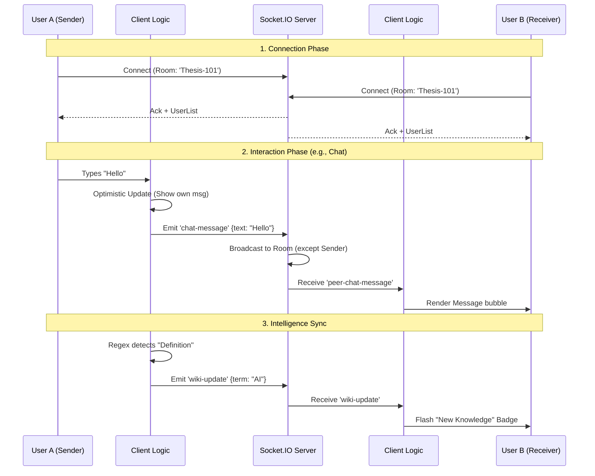

# 🧠 Collaborative Intelligence System Flow

## 1. The Core Concept: "Active Research Partner"
The system converts a passive PDF reader into an **active, intelligent agent** that watches, learns, and assists users in real-time. It operates on two parallel loops: **Intent Detection** (Eye Tracking) and **Knowledge Synthesis** (Collective Memory).

---

## 🔄 Flow 1: The "Collective Memory" Loop
*Preventing knowledge leaks by turning ephemeral chat into permanent knowledge.*

1.  **User Action**: Two peers discuss a complex term in the chat (e.g., *"Wait, what is 'zero-shot learning'?"*).
2.  **Real-Time Interception**: The system intercepts the message before it even reaches the server.
3.  **Intelligent Analysis** (`chatAnalyzer.ts`):
    *   Runs regex/heuristic patterns to detect **Definitions** (`"X is Y"`) or **Insights** (`"I realized that..."`).
    *   *Example*: "Zero-shot learning is when a model predicts classes it hasn't seen during training."
4.  **Knowledge Extraction**:
    *   This sentence is extracted and structured into a `WikiEntry`.
    *   It is tagged with `source: 'chat'` and the author's ID.
5.  **UI Update**:
    *   The **Collective Memory Sidebar** (Right Side) automatically populates with this new entry.
    *   A **Notification Badge** pings on the floating "Book" icon to alert other users.
6.  **Verification**: Other users can click "Verify", promoting the entry to `source: 'verified'`.

**Result**: A shared, persistent "Brain" of the session is built automatically.

---

## 👁️ Flow 2: The "Active Intent" Loop
*Inferring user needs from subconscious behaviors.*

1.  **Gaze & Signal Capture** (`WebGazer.js`):
    *   The system tracks user eye movements (x, y coordinates) on the PDF canvas.
2.  **Fixation Detection** (`EyeTrackingService.ts`):
    *   It calculates valid **Fixations** (staring at a dense area for >2000ms).
    *   It filters out random saccades (rapid eye jumps).
3.  **Semantic Mapping** (In Progress):
    *   The system maps the gaze coordinates (x,y) to the underlying PDF Text Object.
4.  **Proactive Trigger**:
    *   **IF** Fixation Detected on "Unknown Term" -> **THEN** Query Collective Wiki.
    *   **IF** Wiki has definition -> **THEN** Automatically slide open the Wiki Panel.
    *   **IF** No definition -> **THEN** Trigger "Definition Agent" (LLM) to fetch it.

---

## 🏗️ System Architecture

### Frontend (Client Efficiency)
*   **`ApryseWebViewer.tsx`**: The orchestrator. manages PDF rendering, Socket.IO connections, and UI overlays.
*   **`CollectiveWikiPanel.tsx`**: A glassmorphic, Right-Side Overlay responsible for displaying the Knowledge Graph.
*   **`eyeTracking.ts`**: A background service processing raw webcam streams into semantic events (`onFixation`).

### Backend (Real-Time Sync)
*   **`metrics/socket.ts`**: Handles the peer-to-peer synchronization of chat and cursor events.
*   **`chatAnalyzer.ts`**: The "Brain" that parses natural language into structured data.

## � Master System Architecture (The "God View")

This diagram represents the entire codebase ecosystem, including AI features, collaboration tools, and backend services.

```mermaid
graph TD
    %% --- Layer 1: The User Interface (React/Next.js) ---
    subgraph Frontend [Presentation Layer (Client)]
        User((User))
        
        subgraph CoreUI [Core Viewer]
            WebViewer[Apryse PDF Viewer]
            Toolbar[Main Toolbar]
        end
        
        subgraph Panels [Feature Panels]
            WikiUI[Collective Memory Sidebar]
            ReplayUI[Journey Replay Panel]
            SectionUI[Section Assignment Panel]
            ChatUI[Collaboration Chat]
        end
        
        User -->|Interacts| WebViewer
        User -->|Toggles| Panels
    end

    %% --- Layer 2: The Intelligence Engine (Client-Side Logic) ---
    subgraph Intelligence [Intelligence Layer]
        direction TB
        EyeService[Eye Tracking Service (WebGazer)]
        StruggleEngine[Struggle Detection Logic]
        IntentEngine[Fixation/Intent Detector]
        NLP[Chat Analyzer (Regex/NLP)]
        
        %% Connections
        WebViewer -- "Page/Scroll Data" --> StruggleEngine
        EyeService -- "Gaze XY" --> WebViewer
        EyeService -- "Fixation Event" --> IntentEngine
        ChatUI -- "Raw Text" --> NLP
        
        %% Logic Flow
        StruggleEngine -- "Confusion > 3" --> TriggerHelp[Trigger AI Help]
        IntentEngine -- "Stare > 2s" --> TriggerWiki[Open Wiki Definition]
        NLP -- "Definition Found" --> WikiUI
    end

    %% --- Layer 3: Collaboration & Sync (Orchestration) ---
    subgraph Collab [Collaboration Layer]
        Orchestrator[Collaboration Orchestrator]
        SyncEngine[Cursor & Highlight Sync]
        SectionMgr[Section Manager]
        
        %% Connections
        Orchestrator <--> ChatUI
        Orchestrator <--> SectionUI
        SyncEngine <--> WebViewer
    end

    %% --- Layer 4: Backend & Persistence (Server) ---
    subgraph Backend [Server Infrastructure]
        SocketAPI[Socket.IO Server]
        StorageAPI[Insights API]
        AITutor[AI Tutor Endpoint]
        FileSystem[(JSON Database)]
        
        %% Network
        Orchestrator <-->|WebSockets| SocketAPI
        SyncEngine <-->|WebSockets| SocketAPI
        SocketAPI <-->|Broadcast| Peer((Peer User))
        
        %% Data
        StruggleEngine -->|POST| StorageAPI
        StorageAPI <-->|Read/Write| FileSystem
        TriggerHelp -->|Request| AITutor
    end

    %% --- Styling ---
    style Frontend fill:#e3f2fd,stroke:#1565c0
    style Intelligence fill:#f3e5f5,stroke:#7b1fa2
    style Collab fill:#e8f5e9,stroke:#2e7d32
    style Backend fill:#fff3e0,stroke:#e65100
    style LocalDB fill:#eceff1,stroke:#455a64
```

## 🤝 Collaboration Architecture (The "Relay" System)

This sequence diagram details exactly how data moves between two users in real-time.


